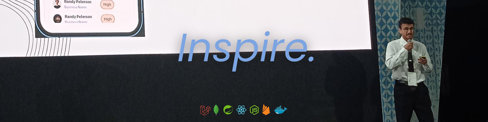

<h2> Hi, I'm Omar Ignammas! </h2>


<p><em>🍵 Software Engineer & 🇲🇦 Moroccan Atay lover </br>Building <a href="https://faundy.netlify.app">Faundy Platform</a> & <a href="https://dikrplaylist.netlify.app">Dhikr Playlist</a> 
</em></p>

[](https://www.linkedin.com/in/omar-ignammas/)
[](https://github.com/omarignammas)
[](https://www.youtube.com/@DhikrV)

###  A little more about me...  
```javascript
const omar = {
  pronouns: "he" | "him",
  location: "Morocco 🇲🇦",
  passions: ["Humanitarian Activism","Freelance", "Mentorship", "Tech for Good"],
  code: ["TypeScript", "JavaScript", "Java", "Python", "PHP"],
  tools: ["React", "Redux", "Node", "Next.js", "Spring Boot", "Docker"],
  architecture: ["Microservices", "Event-Driven", "Design System Patterns"],
  databases: ["PostgreSQL", "MongoDB", "MySQL", "Redis"],
  achievements: {
                  winner: "GITEX Africa Finalist 2024 - Global Stage",
                  mentor: "Empowering next-gen developers",
                  activist: "Tech for social impact"
                },
  techCommunities: {
                      role: "Mentor & Humanitarian Activist",
                      focus: "Building inclusive tech communities",
                      mission: "Impact through education and innovation"
                   },
  currentlyLearning: "System Design & AI Integration 🤖",
  funFact: "Most of my best ideas come with a glass of Moroccan mint tea 🍵"
}
```

 <em><b>Being good is common. Going the extra mile is what turns skill into mastery.!</b> :)</em>

---

### 🌟 Where to find me:

📫 **Email:** omar.ignammas2003@gmail.com  
👨‍💻 **Portfolio:** [ignmas.me](https://ignmas.me)  
📄 **Resume:** [View My CV](https://drive.google.com/file/d/19tUXNksDs3b2mdx9oSFp6U83-RyIg7vU/view?usp=sharing)

---

<h3 align="left">Languages and Tools:</h3>
<p align="center">
  
  
  
  
  
</p>

<p align="center">
  
  
  
  
  
  
</p>

<p align="center">
  
  
  
  
  
  
  
</p>

<p align="center">
  
  
  
  
  
</p>

<p align="center">
  
  
  
</p>

<!-- <div align="center">
  
  
</div> -->

---

<p align="center">
  <em>"Impact is made by helping others grow."</em> ✨<br>
  <strong>— igna</strong>
</p>


